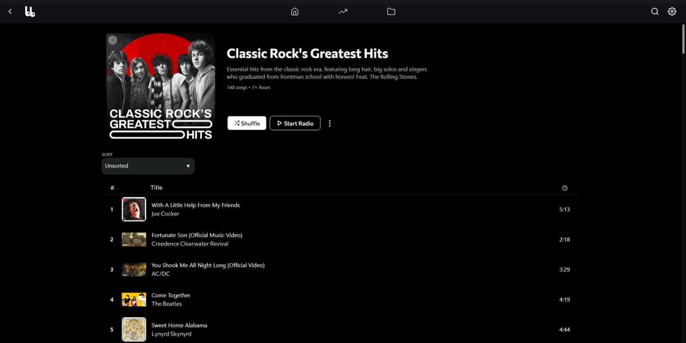
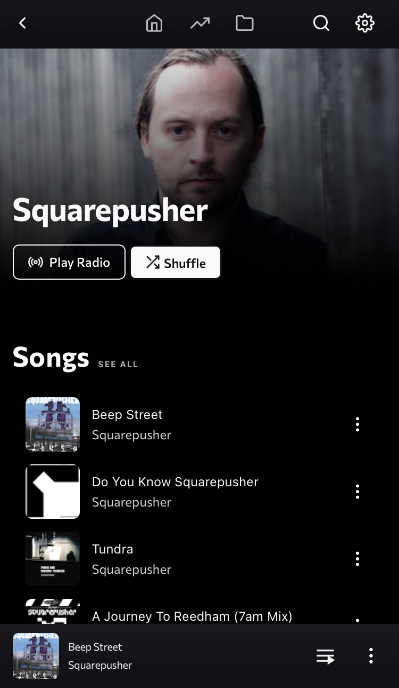
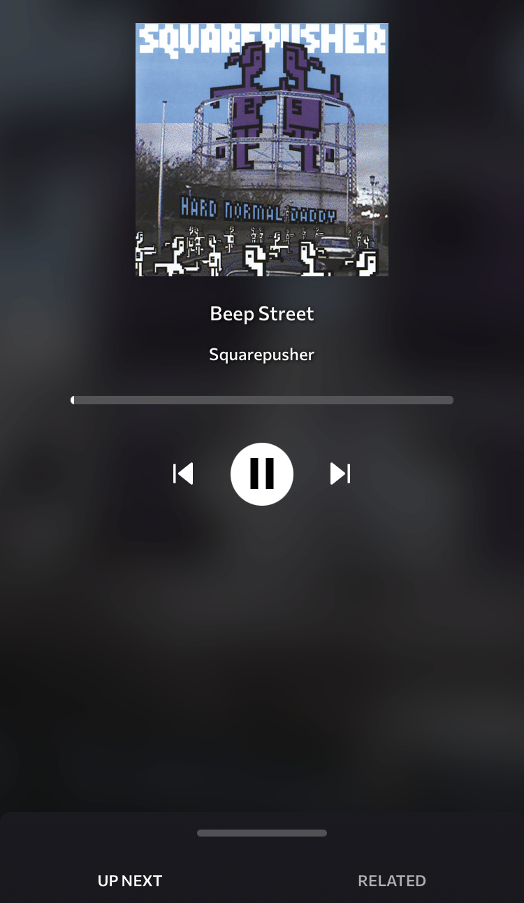

# Beatbump

A privacy-respecting alternative frontend for YouTube Music. Built with SvelteKit, official instance hosted with Cloudflare Workers.

> NOTE: Beatbump is going through a major rewrite, so errors, bugs, and other problems may happen at random.

<div align="center">

|  |  |  |
| ------------------------------------------------ | ------------------------------------------------------------- | ---------------------------------------------- |

</div>
<p align="center">
	  <a href="https://www.gnu.org/licenses/agpl-3.0.en.html">
    
  </a>
  <a href="https://codeberg.org/teaserbot-labs/delightful-humane-design">
    
  </a>
</p>

## Why Beatbump?

Beatbump is a fully-featured music listening experience, while helping to ease your privacy concerns associated with other platforms.

Some of Beatbump's features includes:

- Automix for continued listening
- No ads
- Background play on mobile devices\*
- Search for artists, playlists, songs, and albums
  - Note that all playback is audio only (for now)
- Local playlist management
  - Stored in-browser with IndexedDB
  - Can save songs individually under 'Favorites'
  - Peer-to-Peer data synchronization (using WebRTC)
- Group Sessions
  - Achieved using a WebRTC [mesh](https://en.wikipedia.org/wiki/Mesh_networking)
- Uses a custom wrapper around the YouTube Music API

...and so much more!

> [1] iOS updates may break this from time to time, but works as of iOS 15.6

## Repo Structure

| Directory                     | Description                                           |
| ----------------------------- | ----------------------------------------------------- |
| `app`                         | Beatbump web app                                      |
| `packages/hls-proxy-rewriter` | Proxy server used for Beatbump's music playback (WIP) |


## Instances

> Service Uptime Monitoring: https://stats.uptimerobot.com/9PnmRfz6Gm

| Name                             | URL
| ---                              | ---                                                                       |
| Beatbump (Official)              | https://beatbump.io                                                       |
| ~Vern (Clearnet)                 | https://bb.vern.cc/                                                       |
| ~Vern (Onion)                    | http://bb.vernccvbvyi5qhfzyqengccj7lkove6bjot2xhh5kajhwvidqafczrad.onion/ |
| ~Vern (I2P)                      | http://vern6inmbjzqpecx4kpkq5sln3cqqrfuxfzh4au3tpxbsfbwbnta.b32.i2p/      |
| btb.frail.duckdns.org (Clearnet) | https://btb.frail.duckdns.org/                                            |
| bb.ggtyler.dev (Clearnet)        | https://bb.ggtyler.dev/                                                   |


## Donations

Want to support Beatbump financially to aid with future development/hosting?

[Donate with PayPal!](https://www.paypal.com/donate/?hosted_button_id=E6YRHKS2H2KP2)

Donations of any amount are very much appreciated, so thank you if you choose to donate!

_(Other ways to donate coming soon!)_

## Docker

> Note: Still figuring out how to use Docker! Got a suggestion? Open an issue, thanks!

[DockerHub](https://hub.docker.com/r/snuffydev/beatbump)

### docker-compose (production)
The quickest way to host a Beatbump instance is with [Docker](https://www.docker.com/get-started). Once you have it installed, you can run:

```
docker-compose up
```

The app will now be accessible from `https://localhost:443  /  http://localhost:3000`.

### docker-compose (development)


(More details coming soon!)

## Documentation

You can find (temporary, incomplete, and in-progress) API documentation here: https://beatbump-docs.vercel.app/

> It's recommended (and appreciated) to host your own instance of Beatbump for public projects that want to use the data -- especially if you anticipate you will be making a large amount of requests. Thanks!

## Project Inspirations

- [Invidious](https://github.com/iv-org/invidious) - a privacy focused alternative YouTube front end.
